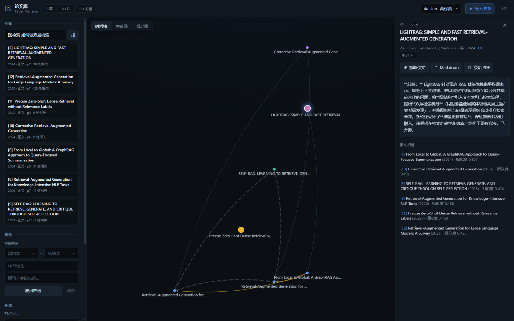
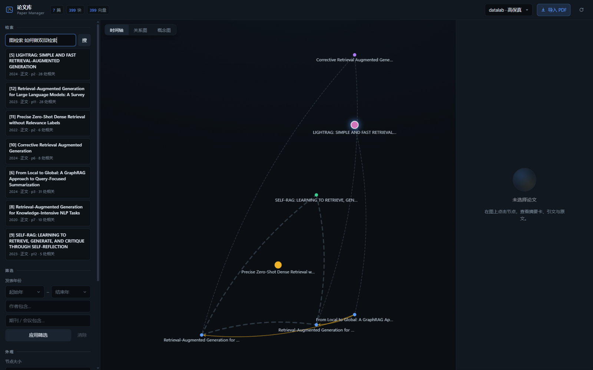
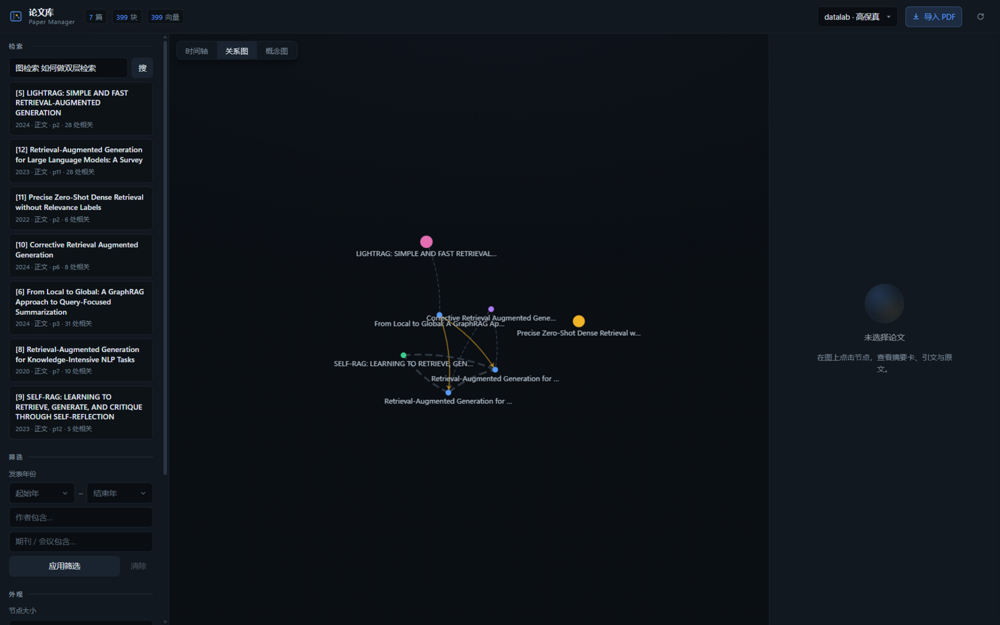
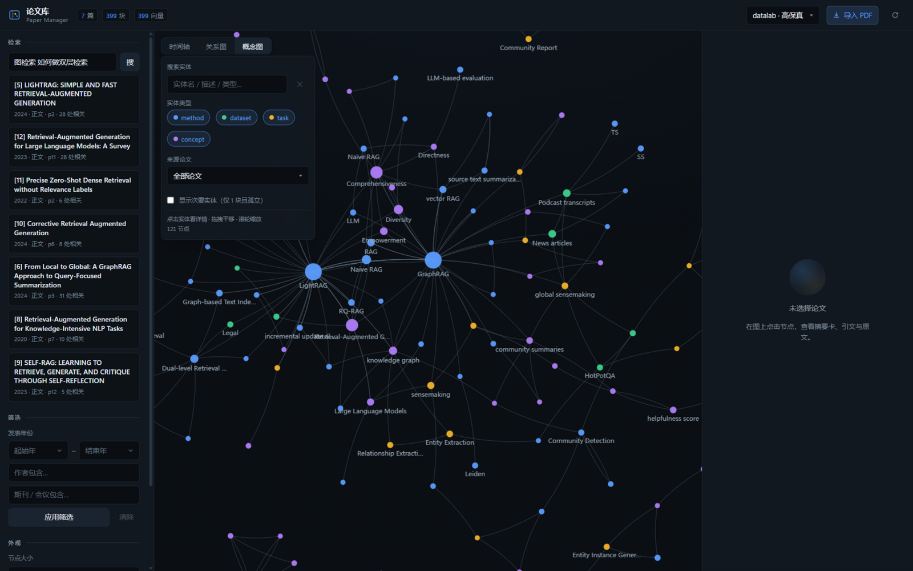

# Paper Manager — 本地论文库（PDF → Markdown → 混合检索 → MCP）

导入论文 PDF，自动转成 Markdown、切块、向量化，并生成 3-5 句"摘要卡"。
**首要用户是 Agent（MCP）**：会话开场用 `library_overview` 了解你在做什么方向，
再检索/精读/回写标签；人自己也可以用 CLI/Web 查库。
检索时先拿摘要卡和最匹配片段，需要时再深入读章节——**省 token** 是第一设计目标。

架构参考了 [PaperQA2](https://github.com/future-house/paper-qa)（引用对齐、
top-k 片段注入）与 [LightRAG](https://github.com/HKUDS/LightRAG)（概念图双层检索）。
检索管线：FTS5 + 向量 → RRF 融合 → Reranker 重排。



## 特性一览

- **入库管线**：PDF→Markdown（Datalab Marker 云端高保真 / PyMuPDF 本地免费双引擎）
  → 元数据抽取（首页标题/作者/年份/DOI，PDF Info 截断时自动回退正文）→ LLM 摘要卡 → 章节感知切块 → bge-m3 向量；
- **两阶段检索**：PaperQA2 风格"论文级召回 → 章节级聚合"，LLM 查询改写 + RRF + 重排；
- **全链路降级**：无 Embedding → 纯 FTS5；无 LLM → 跳过摘要卡；断网/欠费时库依然可检索；
- **MCP 服务**：10 个工具（stdio / HTTP 双模式），任何 MCP 客户端即插即用；
  会话开始先 `library_overview` 拿研究方向画像，可用 `annotate_paper` 打标签；
- **Zotero 集成**：本机 zotero.sqlite 只读检索 → 一键导入精读库，无需另装 zotero-mcp；
- **引文图**：OpenAlex（免 key）+ Semantic Scholar 备用，库内引用关系自动连线；
- **概念图**：LightRAG 式 LLM 实体/关系抽取 + "概念 → 章节证据"双层检索；
- **可视化**：Gephi Lite 式三栏界面（时间轴 / 引文关系图 / 2D 概念图），
  Vite + React + TypeScript 前端，构建产物已入库、clone 即用；
- **Agent 研究画像**：`library_overview` 聚合主题/代表论文/缺口；`annotate_paper` 写标签与笔记并进检索；
- **评测防回退**：33 条标注用例跑在 10 篇确定性合成论文上，recall@5 / MRR / 延迟一键回归。

## 快速开始

```bash
pip install -r requirements.txt
cp .env.example .env    # 填好 LLM / Embedding / Datalab key（全部可缺省，自动降级）

# 导入（默认 datalab 引擎：高保真 Marker 云端转换，按页计费，多 key 自动轮询）
python cli.py ingest /path/to/some-paper.pdf
python cli.py ingest /path/to/notes.pdf --engine local   # 免费纯文本抽取（可选）

# 检索
python cli.py search "attention 机制的效率优化"
python cli.py read 1 --section method
python cli.py status

# 从已存 Markdown 重抽标题/作者（不重切块；修「佚名」/截断标题）
python cli.py refresh-meta

# 补齐缺失作者（OpenAlex/S2）与摘要卡（LLM）；--force 连已有字段也重拉
python cli.py enrich

# 研究方向画像：主题词、代表论文、数据缺口（Agent 会话开场用）
python cli.py overview

# 给论文打主题标签/笔记（合并写入；--replace 整体替换；--notes "" 可清空笔记）
python cli.py annotate 6 --topics "GraphRAG,方法对比,精读" --notes "全局摘要主文"
```

## 数据流

```
PDF ──convert──> Markdown(data/markdown/<sha>.md)
        datalab(默认): Marker 云端，高保真，按页计费，多 key 轮询
        local: PyMuPDF 文本抽取，插入 <!-- page:N --> 页码标记（免费）
      ──> 元数据（首页多行标题 + 作者启发式；PDF Info 仅作补充）
      ──> LLM 摘要卡 3-5 句（papers.summary，可 --no-summary）
      ──> 章节感知切块（300-800 tokens，带 section/page 元数据）
      ──> bge-m3 嵌入（批量 16，失败自动降级为纯 FTS5）
      ──> SQLite（data/papers.db: papers/chunks/FTS5/chunk_vectors）
```

### Datalab 多 key 轮询

`.env` 里用逗号分隔多个 key：

```dotenv
DATALAB_API_KEYS=key1,key2,key3
```

- 每次转换从第一个可用 key 开始；某个 key 返回 HTTP 402 或
  payment/credit/额度 类错误时，自动标记耗尽并切下一个，无需人工干预；
- 耗尽记录存在 `data/datalab_keys.json`（只存 key 的 sha256 前缀，不存明文），
  **6 小时后自动重试**（中途充值即可恢复）；
- CLI/MCP 的入库报告会显示本次用的 key 序号、剩余可用数和精确费用（来自 Datalab 的 cost_breakdown）。

### 两阶段检索（PaperQA2 风格）

```
问题 ──LLM 改写──> 2-3 组中英文检索关键词（可选，失败退回原查询）
        ↓
阶段一（论文级）：papers_fts ⊕ 论文向量（标题+摘要+摘要卡）→ RRF → top-20 候选论文
        ↓
阶段二（章节级）：候选论文内 FTS ⊕ 向量 → RRF → 论文得分聚合
        ↓
论文得分 = 最佳 chunk 得分 × (1 + 0.1 × 额外命中段落数, 上限5) → bge-reranker 校正
        ↓
命中卡：标题 + 摘要卡 + 最佳片段（含章节/页码/相关段落数）
```

- 论文级索引在导入时自动构建；存量论文在首次检索或 `python cli.py backfill` 时补齐；
- 阶段一为空或无论文向量时自动降级为全局章节检索；所有外部服务失败均静默降级到 FTS5；
- 库内日志全部走 stderr，MCP stdio 协议不受 print 污染。

### Agent 研究方向画像（overview + annotate）

定位：**给 Agent 管理的本地论文库**，不是聊天问答产品。

```text
library_overview()     # 规模 / 方向判断 / 代表论文 / 数据缺口（无 LLM）
        ↓
search_papers / list_papers   # 命中卡带 #主题标签
        ↓
read_paper_section(paper_id, section)
        ↓
annotate_paper(paper_id, topics=[...], notes="…")   # 读完回写，刷新 FTS
```

- **方向判断优先级**：人工/Agent 标注 `topics` → 概念图实体 → 标题/摘要高频词；
- **topics**：`;` 分隔存储，默认合并写入，`replace_topics` / `--replace` 整体覆盖；
- **notes**：自由笔记，供后续会话回忆；
- 标签会进入 `papers_fts`，`search_papers` 可按标签词召回；
- CLI：`python cli.py overview` / `annotate`；HTTP：`GET /api/overview`、`POST /api/annotate/{id}`。

## MCP 接入（给 agent 用）

stdio 方式，在客户端的 `.mcp.json` 加（`command` 用你的 Python 解释器绝对路径，
`cwd` 为本仓库根目录）：

```json
"papers": {
  "command": "/absolute/path/to/python",
  "args": ["-m", "paper_manager.mcp_server"],
  "cwd": "/absolute/path/to/paper_manager"
}
```

暴露 10 个工具（均按 token 预算设计返回体）：

| 工具 | 作用 |
|------|------|
| `library_overview()` | **会话开场先调**：研究方向、代表论文、数据缺口（无 LLM，纯本地聚合） |
| `annotate_paper(paper_id, topics?, notes?, replace_topics?)` | 写主题标签/笔记，默认合并；写入后刷新论文级 FTS |
| `search_papers(query, top_k, year_min?, year_max?, author?, venue?)` | 两阶段检索（论文级召回→章节级聚合），摘要级命中卡，可叠加元数据过滤 |
| `read_paper_section(paper_id, section)` | 深入读某章节，默认 6000 字符截断 |
| `list_papers()` | 库清单（含主题标签与短摘要） |
| `ingest_pdf(path, engine)` | 导入新 PDF |
| `search_graph(query, top_k)` | 概念图检索（实体→邻域→证据章节） |
| `search_zotero(query, limit)` | 在本机 Zotero 藏书里按标题/作者/DOI 搜索并解析本地 PDF 路径 |
| `get_zotero_item(key)` | 查看单条 Zotero 元数据与附件路径 |
| `ingest_from_zotero(key, engine)` | 从 Zotero 条目导入 PDF 到精读库（幂等） |

### Zotero 一站式精读（无需再装 zotero-mcp）

同一 MCP 里即可完成「Zotero 找文献 → 入库 → 章节深读」：

```text
1. library_overview()
2. [可选] annotate_paper(paper_id, topics=["方法对比"])
3. search_zotero("GraphRAG")
4. ingest_from_zotero("<item_key>", engine="local")
5. search_papers("双层检索") / read_paper_section(paper_id, "method")
```

要求本机 Zotero 数据目录可读（默认 `~/Zotero`）；特殊路径用
`ZOTERO_DB_PATH` 指向 `zotero.sqlite`。CLI 等价命令：

```bash
python cli.py zotero-search "GraphRAG"
python cli.py zotero-ingest <ITEM_KEY> --engine local
```

HTTP 方式：`python -m paper_manager.mcp_server --http`（127.0.0.1:8820/mcp）。

## 环境变量

见 [.env.example](.env.example)。全部服务可缺省：
无 Embedding → 纯 FTS5；无 LLM → 跳过摘要卡；无 Datalab key → 只用本地引擎。

## 检索评测（防回退）

`evals/` 内置 33 条标注用例（中文自然语言、英文关键词、中英混合、
易混淆论文对、元数据过滤），跑在 **10 篇确定性合成论文**上——
评测库位于 `evals/library/`，与你的真实 `data/` 完全隔离。

```bash
python evals/build_library.py   # 一次性构建评测库（免费 local 引擎，无 LLM 摘要）
python evals/run_eval.py        # recall@5 / MRR / 延迟；低于阈值退出码 1
python evals/run_eval.py --k 3 --min-recall 0.9 --json
python evals/run_eval.py --rewrite   # 加上 LLM 查询改写（非确定性，默认关）
```

当前基线：**recall@5 = 100%，MRR = 1.000，中位延迟 ~0.7s**。
改任何检索参数（RRF k、chunk 大小、切块策略）后重跑一遍，防止调坏。
基线会随用例库更新而变化，重大改动后在 README 记录新基线。

## 可视化界面（Gephi Lite 式三栏：检索/筛选 · 图画布 · 详情）

```bash
python -m paper_manager.server                 # http://127.0.0.1:8830
python -m paper_manager.server --host 0.0.0.0  # 局域网/VPN 内其他设备可访问
```

前端为 Vite + React + TypeScript 工程（`web/`，Tailwind 4 + [ECharts](https://echarts.apache.org)）。
构建产物 `web/dist/` 已入库，由 FastAPI 直接挂载——clone 后不装 Node 也能一条命令启动。
改前端才需要重新构建：

```bash
cd web && npm install && npm run build   # 产物输出到 web/dist/
cd web && npm run dev                    # 开发模式（:5173，/api 代理到 :8830）
```

- **三视图**：时间轴（横轴年份、引文簇分行）⇄ 引文关系图（力导向）⇄ 概念图（2D 力导向），一键切换；
- **关系编码**：实线箭头 = 引文（指向被引论文），虚线 = 语义相近（阈值可调），
  边粗细随相似度变化；节点大小按被引数/章节块数编码；
- **左栏**：语义检索（两阶段混合检索）、元数据筛选（年份/作者/期刊，不匹配节点
  变暗而非消失）、外观开关、聚类图例（点击单簇隔离）、PDF 导入（双引擎）；
- **详情面板**：摘要卡、可展开摘要、被引数徽章，三类可点击邻居（库内引用/被引/
  语义相近），一键抓取引文、查看 Markdown（react-markdown 渲染弹窗）、打开原始 PDF；
- 视图与选中状态写入 URL（`?view=kg&paper=5&entity=49`），刷新与跨设备分享不丢；Esc 关闭面板；
- 论文视图悬停高亮相邻关系（`focus: adjacency`）、标签防重叠（`hideOverlap`）。

**时间轴视图**（横轴年份，引文簇分行，实线=引用方向、虚线=语义相似）：



**关系图视图**（力导向布局，拖拽/滚轮缩放）：



## 引文图

引文数据来自 [OpenAlex](https://openalex.org)（免费无需 key），
Semantic Scholar 作为备用源（其未认证通道限流严格；可免费申请
`S2_API_KEY` 填入 .env 提高可靠性）。

```bash
python cli.py fetch-citations        # 抓取所有未抓取论文的引文关系
python cli.py fetch-citations 3      # 只抓某一篇
python cli.py related 3              # 查看邻居：库内引用/被引 + 语义相近
```

注意事项：

- 很新的 arXiv 论文在 OpenAlex 上可能**没有参考文献列表**（被引列表通常可用）；
  少数论文（如 GraphRAG 原文）暂时未被收录——这类论文**不会**被标记为已抓取，
  `fetch-citations` 每次运行都会自动重试，收录后连线自动补上；
- 每篇论文最多取 100 条参考文献、100 条被引（按发表日期升序，最早的引用者
  最可能是你库里的论文）；
- arXiv 预印本没有印刷版 DOI，入库时自动合成 `10.48550/arXiv.<id>` 用于解析；
- 引文行按 DOI 优先、归一化标题包含匹配兜底关联到库内论文（容忍 PDF 换行截断的标题）。

## 概念图（LightRAG 式）

LLM 从每个章节块抽取实体（method/dataset/task/concept）
与关系，按归一化名称跨批次去重；每个章节块链接到它提到的实体，形成
"概念 → 章节证据"的双层结构。

```bash
python cli.py build-kg --all      # 为所有未构建论文抽取概念图（走 LLM）
python cli.py kg "graph rag 双层检索"   # 概念检索
```

概念检索（`search_graph`，MCP 工具同名）与 `search_papers` 互补：
普通语义搜索对"哪些论文用了 X 方法""X 和 Y 什么关系"这类概念性问题
命中率低——概念检索先命中实体、沿关系扩展一跳邻居、再回溯到讨论这些
概念的章节，按论文聚合。命中卡与两阶段检索同构。

UI「概念图」视图：ECharts 2D 力导向实体网络（拖拽平移 / 滚轮缩放），节点按类型着色
（method/dataset/task/concept）、大小 = 关联章节块数，连线保持中性灰；支持实体搜索、
类型开关、按来源论文过滤、隐藏次要实体。点击实体看描述、关系与相关论文。悬停高亮
邻域，默认只常显较高频实体标签，避免 200+ 节点时标签重叠。



## Roadmap

- **P1 引文图（已完成）**：OpenAlex/Semantic Scholar 抓取、`related_papers`
  工具（CLI + MCP）、时间轴 + 力导向可视化。
- **P2 概念图（已完成）**：LLM 实体/关系抽取、双层概念检索、UI 第三视图。
- 候选方向：共引/耦合边、跨库合并、LLM 综述报告生成。

## 设计说明

- 单 SQLite 文件 + 暴力余弦（numpy）：个人库规模（数百篇 × 数万 chunk）
  毫秒级返回，不需要向量数据库。
- `sha256` 去重：同一 PDF 重复导入直接跳过（`--force` 强制重建）。
- 所有外部服务调用都有降级路径，断网/欠费时库依然可检索。
- 真实论文库（`data/`）与密钥（`.env`）不入库；评测用例（`evals/cases.json`）入库，
  评测合成库（`evals/library/`）可一键重建、不入库。
